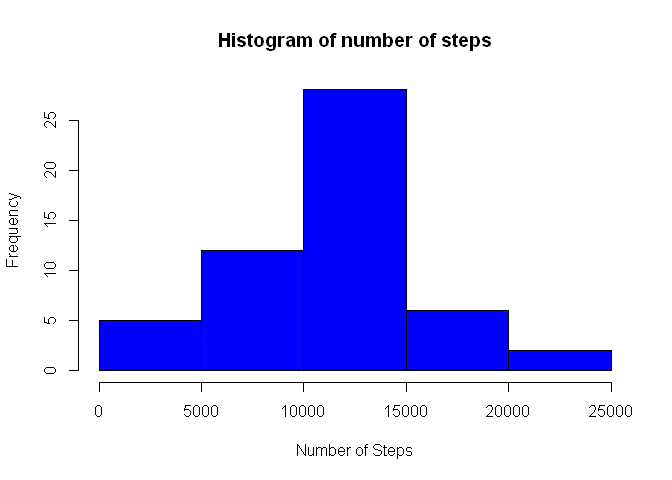
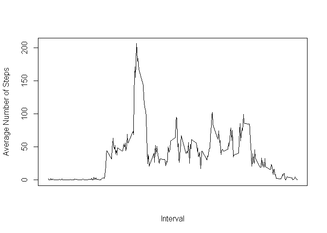
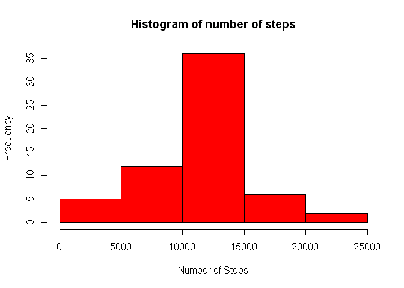
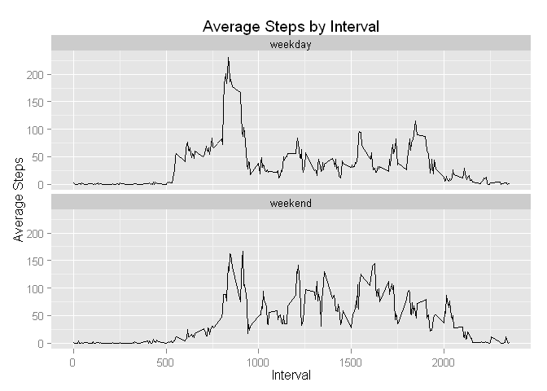

# Reproducible Research: Peer Assessment 1


## Loading and preprocessing the data

```r
steps_loaded <- read.csv("activity.csv")
steps_loaded$date <- as.Date(steps_loaded$date)
```

## What is mean total number of steps taken per day?

```r
# Load the sqldf library
library(sqldf)
```

```
## Loading required package: gsubfn
## Loading required package: proto
## Loading required package: RSQLite
## Loading required package: DBI
## Loading required package: RSQLite.extfuns
```

```r
# Creating the dataset having the total number of steps by date

steps_by_date <- sqldf("select date,sum(steps) from steps_loaded group by date",row.names = TRUE)
```

```
## Loading required package: tcltk
```

```r
names(steps_by_date) <- c("date","numsteps")

steps_by_date$numsteps <- as.integer(steps_by_date$numsteps)
na_rows_filter <- complete.cases(steps_by_date) 
steps_by_date <- steps_by_date[na_rows_filter,]  # Removing the NA rows

# Plotting the histogram
hist(steps_by_date$numsteps,freq=TRUE,xlab="Number of Steps",ylab = "Frequency",main="Histogram of number of steps",col="blue")
```

 

```r
# Calculating the mean and median
mean(steps_by_date$numsteps)
```

```
## [1] 10766
```

```r
median(steps_by_date$numsteps)
```

```
## [1] 10765
```

## What is the average daily activity pattern?

```r
# Creating the dataset having average number of steps by interval

steps_by_interval <- sqldf("select interval,avg(steps) from steps_loaded group by interval",row.names = TRUE)
names(steps_by_interval) <- c("interval","avgsteps")

#Plotting the data
with(steps_by_interval,plot(interval,avgsteps,type="l",xlab="Interval",ylab="Average Number of Steps",xaxt="n"))
```

 

```r
# Calculating the Interval that has the highest average number of steps across all days
steps_by_interval[(which.max(steps_by_interval[,2])),1]
```

```
## [1] 835
```
## Imputing missing values

```r
na_vector <- is.na(steps_loaded$steps)   # Filter for NA rows
steps_na_rows <- steps_loaded[na_vector,] # All rows with NA values for steps
nrow(steps_na_rows)   # Number of NA rows in the dataset
```

```
## [1] 2304
```

```r
steps_not_na_rows <- steps_loaded[!na_vector,]  # All rows with no NA values for steps

# Getting to the imputed values by merging the datasets
steps_merged <- merge(steps_na_rows,steps_by_interval,by.x="interval",by.y="interval")
steps_for_na_rows <- sqldf("select avgsteps as steps, date, interval from steps_merged",row.names=TRUE)

# Create the full dataset
steps_full_set <- rbind(steps_not_na_rows,steps_for_na_rows)
steps_full_set$steps <- as.integer(steps_full_set$steps) # New dataset with all data filled in

steps_by_date_fullset <- sqldf("select date,sum(steps) from steps_full_set group by date",row.names = TRUE)
names(steps_by_date_fullset) <- c("date","numsteps")

# Plotting the histogram for the full dataset with no NA rows
hist(steps_by_date_fullset$numsteps,freq=TRUE,xlab="Number of Steps",ylab = "Frequency",main="Histogram of number of steps",col="red")
```

 

```r
# Calculating the mean and median
mean(steps_by_date_fullset$numsteps)
```

```
## [1] 10750
```

```r
median(steps_by_date_fullset$numsteps)
```

```
## [1] 10641
```
## Are there differences in activity patterns between weekdays and weekends?

```r
# Setting the weekend flag

steps_full_set$day <- weekdays(steps_full_set$date)
steps_full_set$weekendflag <- ifelse(steps_full_set$day == "Saturday"| steps_full_set$day == "Sunday","weekend","weekday")
steps_full_set$weekendflag <- as.factor(steps_full_set$weekendflag)

# Calculating the average steps by weekend and weekdays

steps_by_weekendflag <- sqldf("select interval,avg(steps),weekendflag from steps_full_set group by interval,weekendflag",row.names = TRUE)
names(steps_by_weekendflag) <- c("interval","avgsteps","weekendflag")

# Setting up the plot using ggplot system

library(ggplot2)

# Setup ggplot with data frame

g <- ggplot(steps_by_weekendflag,aes(interval,avgsteps))
# Add layers to the plot

g <- g + geom_line() + facet_wrap( ~ weekendflag, ncol=1) + labs(x = "Interval") + labs(y = "Average Steps") + labs(title = "Average Steps by Interval")

print(g)
```

 
